# Introduction to Data Warehousing

In this final assignment, I am applying the skills I have acquired from the **[Data Warehouse Fundamentals](https://www.coursera.org/learn/data-warehouse-fundamentals)** course. This involves designing, implementing, and querying a data warehouse using PostgreSQL as well as creating visualizations with IBM Cognos Analytics for a waste management company in Brazil.

This assignment has five parts: 

- [Exercise 1 - Design a Data Warehouse](#exercise-1---design-a-data-warehouse)
    - [Design the dimension table MyDimDate](#design-the-dimension-table-mydimdate)
    - [Design the dimension table MyDimWaste](#design-the-dimension-table-mydimwaste)
    - [Design the dimension table MyDimZone](#design-the-dimension-table-mydimzone)
    - [Design the fact table MyFactTrips](#design-the-fact-table-myfacttrips)
- [Exercise 2 - Create schema for Data Warehouse on PostgreSQL](#exercise-2---create-schema-for-data-warehouse-on-postgresql)
    - [Create the dimension table MyDimDate](#create-the-dimension-table-mydimdate)
    - [Create the dimension table MyDimWaste](#create-the-dimension-tablemydimwaste)
    - [Create the dimension table MyDimZone](#create-the-dimension-tablemydimzone)
    - [Create the fact table MyFactTrips](#create-the-fact-tablemyfacttrips)
- [Exercise 3 - Load data into the Data Warehouse](#exercise-3---load-data-into-the-data-warehouse)
    - [Load data into the dimension table DimDate](#load-data-into-the-dimension-tabledimdate)
    - [Load data into the dimension table DimTruck](#load-data-into-the-dimension-tabledimtruck)
    - [Load data into the dimension table DimStation](#load-data-into-the-dimension-tabledimstation)
    - [Load data into the fact table FactTrips](#load-data-into-thefacttablefacttrips)
- [Exercise 4 - Write aggregation queries and create MQTs](#exercise-4---write-aggregation-queries-and-create-mqts)
    - [Create a grouping sets query](#create-a-grouping-sets-query)
    - [Create a rollup query](#create-a-rollup-query)
    - [Create a cube query](#create-a-cube-query)
    - [Create an MQT](#create-an-mqt)
- [Exercise 5 - Create a dashboard using Cognos Analytics](#exercise-5---create-a-dashboard-using-cognos-analytics)
    - [Create a pie chart in the dashboard](#create-a-pie-chart-in-the-dashboard)
    - [Create a bar chart in the dashboard](#create-a-bar-chart-in-the-dashboard)
    - [Create a line chart in the dashboard](#create-a-line-chart-in-the-dashboard)
    - [Create a pie chart in the dashboard](#create-a-pie-chart-in-the-dashboard-1)

  
## Exercise 1 - Design a Data Warehouse

The solid waste management company has provided the following sample data they wish to collect.


I have been tasked with designing a star schema data warehouse that can support the queries listed below:

* total waste collected per year per city
* total waste collected per month per city
* total waste collected per quarter per city
* total waste collected per year per trucktype
* total waste collected per trucktype per city
* total waste collected per trucktype per station per city

The company is looking for a **granularity of day** with the ability to generate the report on a yearly, monthly, daily, and weekday basis.


### Design the dimension table MyDimDate

The final MyDimDate table will look like this:

| Field Name | Details |
|---|---|
| DateID | Primary Key - Unique identifier for each date |
| Date | Full date from the date field of the original data |
| Year | Year derived from the date field of the original data. Example: 2020 |
| Quarter | Quarter number derived from the date field of the original data. Example: 1, 2, 3, 4 |
| QuarterName | Quarter name derived from the date field of the original data. Example: Q1, Q2, Q3, Q4 |
| Month | Month number derived from the date field of the original data. Example: 1, 2, 3 |
| MonthName | Month name derived from the date field of the original data. Example: January |
| Day | Day derived from the date field of the original data. Example: 23, 24 |
| Weekday | Weekday derived from the date field of the original data. Example: 1, 2, 3, 4, 5, 6, 7. 1 for Sunday, 7 for Saturday |
| WeekdayName | Weekday name derived from the date field of the original data. Example: Sunday, Monday |

### Design the dimension table MyDimWaste

The final MyDimWaste table will look like this:

| Field Name | Details |
|---|---|
| WasteID | Primary Key - Unique identifier for each waste type |
| WasteType | Type of waste. Example: Dry, Electronic, Plastic, Wet |

### Design the dimension table MyDimZone

The final MyDimZone table will look like this:

| Field Name | Details |
|---|---|
| ZoneID | Primary Key - Unique identifier for each collection zone |
| CollectionZone | Zone where waste is collected. Example: South, Central, West |
| City | City where the zone is located. Example: Sao Paulo, Rio de Janeiro |

### Design the fact table MyFactTrips

The final MyFactTrips table will look like this:

| Field Name | Details |
|---|---|
| TripID | Primary key - Unique identifier for each waste collection trip |
| DateID | Foreign Key - References the DateID in the MyDimDate table |
| WasteID | Foreign Key - References the WasteID in the MyDimWaste table |
| ZoneID | Foreign Key - References the ZoneID in the MyDimZone table |
| WasteCollectedTon | Amount of waste collected in tons |


## Exercise 2 - Create schema for Data Warehouse on PostgreSQL


### Create the dimension table MyDimDate

```text
CREATE TABLE "MyDimDate" (
    DateID INTEGER NOT NULL PRIMARY KEY,
    Date DATE NOT NULL,
    Year SMALLINT NOT NULL,
    Quarter SMALLINT NOT NULL CHECK (Quarter BETWEEN 1 AND 4),
    QuarterName VARCHAR(2) NOT NULL,
    Month SMALLINT NOT NULL CHECK (Month BETWEEN 1 AND 12),
    MonthName VARCHAR(9) NOT NULL,
    Day SMALLINT NOT NULL CHECK (Day BETWEEN 1 AND 31),
    Weekday SMALLINT NOT NULL CHECK (Weekday BETWEEN 1 AND 7),
    WeekdayName VARCHAR(9) NOT NULL
);
```

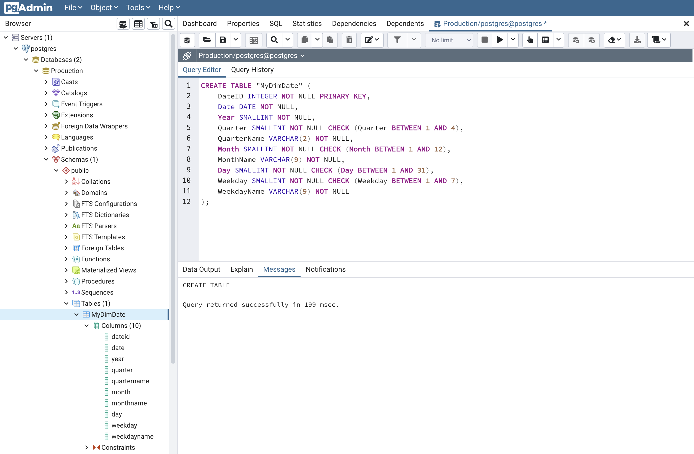

### Create the dimension table MyDimWaste

```text
CREATE TABLE "MyDimWaste" (
    WasteID INTEGER NOT NULL PRIMARY KEY,
    WasteType VARCHAR(50) NOT NULL
);
```

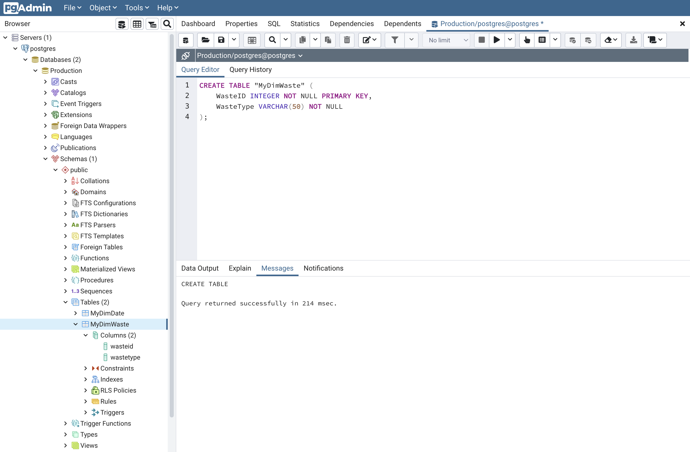

### Create the dimension table MyDimZone

```text
CREATE TABLE "MyDimZone" (
    ZoneID INTEGER NOT NULL PRIMARY KEY,
    CollectionZone VARCHAR(50) NOT NULL,
    City VARCHAR(50) NOT NULL
);
```

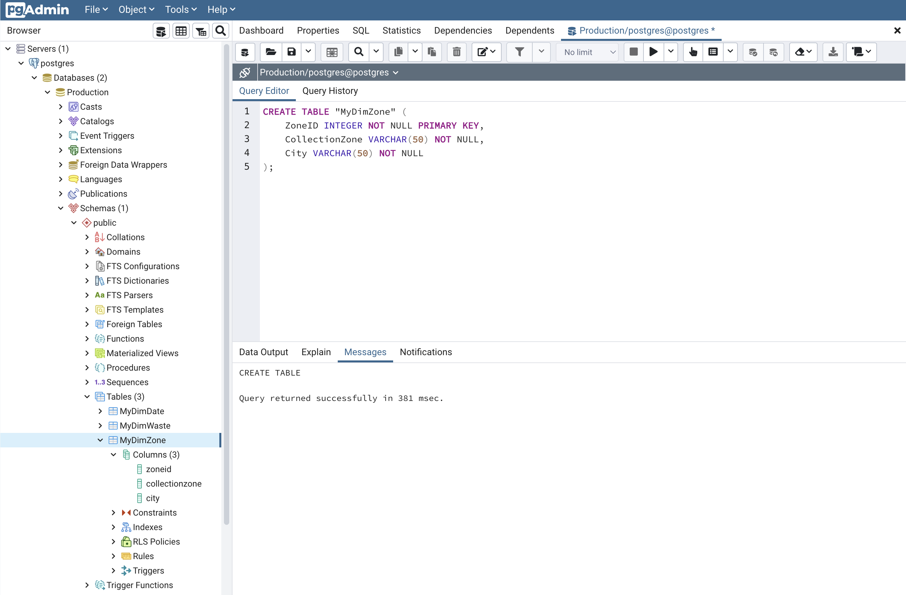

### Create the fact table MyFactTrips

```text
CREATE TABLE "MyFactTrips" (
    TripID SERIAL PRIMARY KEY,
    DateID INTEGER NOT NULL,
    WasteID INTEGER NOT NULL,
    ZoneID INTEGER NOT NULL,
    WasteCollectedTons DECIMAL(10, 2) NOT NULL,
    FOREIGN KEY (DateID) REFERENCES "MyDimDate" (DateID),
    FOREIGN KEY (WasteID) REFERENCES "MyDimWaste" (WasteID),
    FOREIGN KEY (ZoneID) REFERENCES "MyDimZone" (ZoneID)
);
```


## Exercise 3 - Load data into the Data Warehouse

*Following the initial schema design, the company notified me that, due to operational challenges, they were unable to collect the data in the originally intended format.*

*This means that the previous tables (MyDimDate, MyDimWaste, MyDimZone, MyFactTrips) and their associated attributes are no longer applicable to the current design. The company has loaded data using CSV files as per the new design.*

* [DimDate.csv](./DimDate.csv)
* [DimStation.csv](./DimStation.csv)
* [DimTruck.csv](./DimTruck.csv)
* [FactTrips.csv](./FactTrips.csv)

*For convenience, I have provided the [03-star-schema.sql](./03-star-schema.sql) script in this repo to create the DimDate, DimStation, DimTruck, and FactTrips tables.*

1. Click on **Query Tool** and then click on **Open File**.

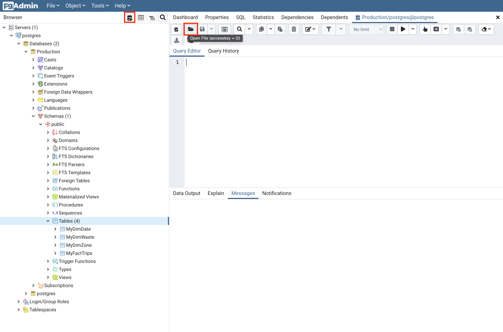

2. Next, a new page pops up called **Select file**. Click on the **Upload File** icon as shown in the screenshot.

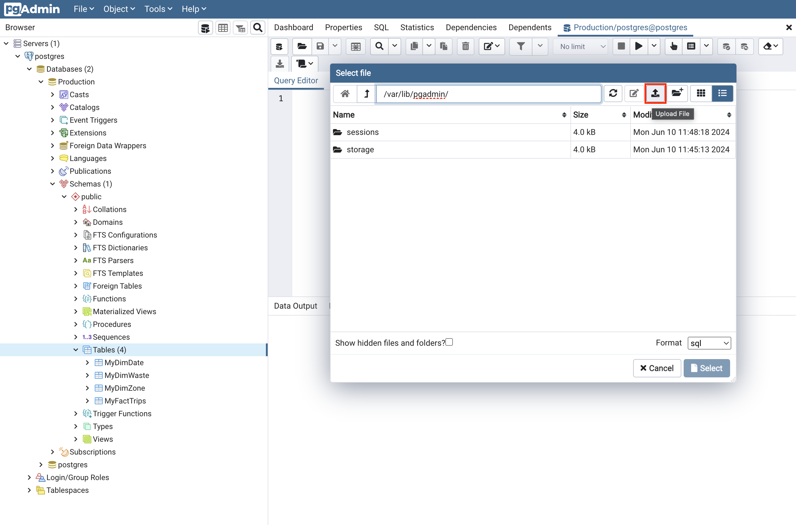

3. Drag and drop the `03-star-schema.sql` file inside the blank page. Once the `03-star-schema.sql` file is successfully loaded, click on the **X** icon on the right hand side of the page as shown in the screenshot.

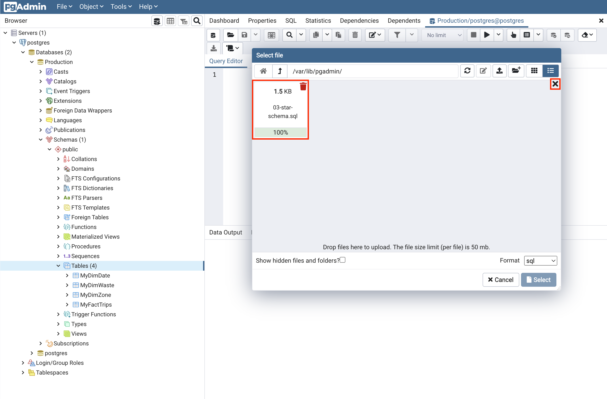

4. Once you click on the **X** icon a new page appears with the file `03-star-schema.sql`. Select the `03-star-schema.sql` file from the list and click on **Select**.

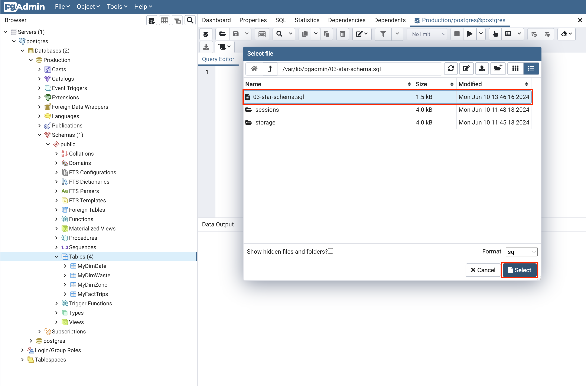

5. Execute the `03-star-schema.sql` file.

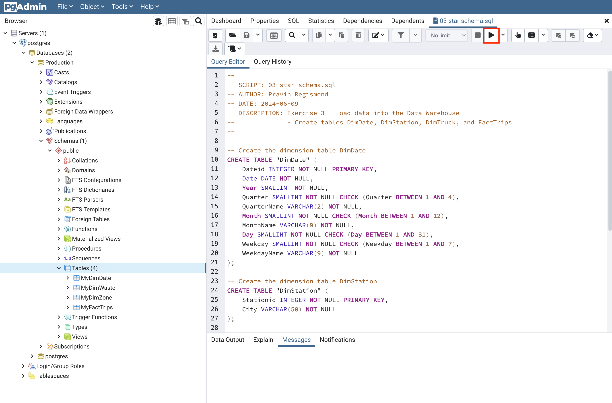

6. Next, right-click on the **Production** database and click on the **Refresh** option from the dropdown. After the database is refreshed the 4 tables (DimDate, DimStation, DimTruck, FactTrips) are created under the **Databases > Production > Schemas > public > Tables**.

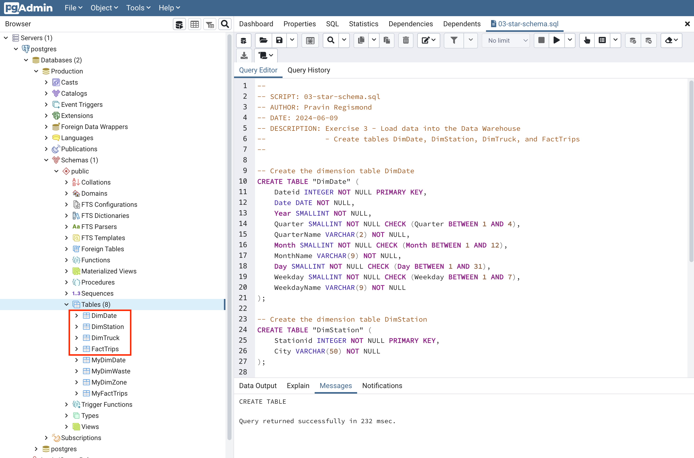


### Load data into the dimension table DimDate

1. In the tree-view, right-click on **DimDate** and go to **Import/Export…**

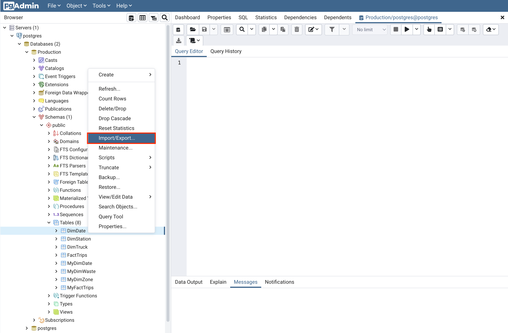

2. Follow the instructions below to import:

* Make sure **Import/Export** is set to **Import**, **Format** = **csv** and **Header** = **Yes**. Then click the **Select file** icon by the **Filename** box.


* Click on the **Upload File** icon. Drag and drop the `DimDate.csv` file as shown earlier. Then, click on the **X** icon on the right hand side of the page.

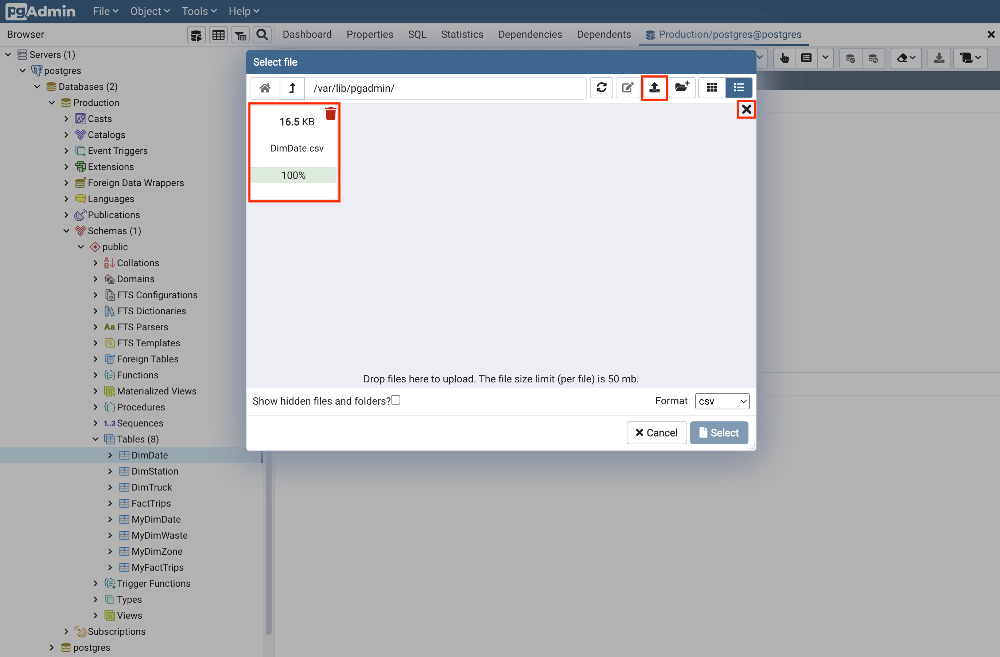

* Once you click on the **X** icon a new page appears with the file `DimDate.csv`. Select the `DimDate.csv` file from the list and click the **Select** button.

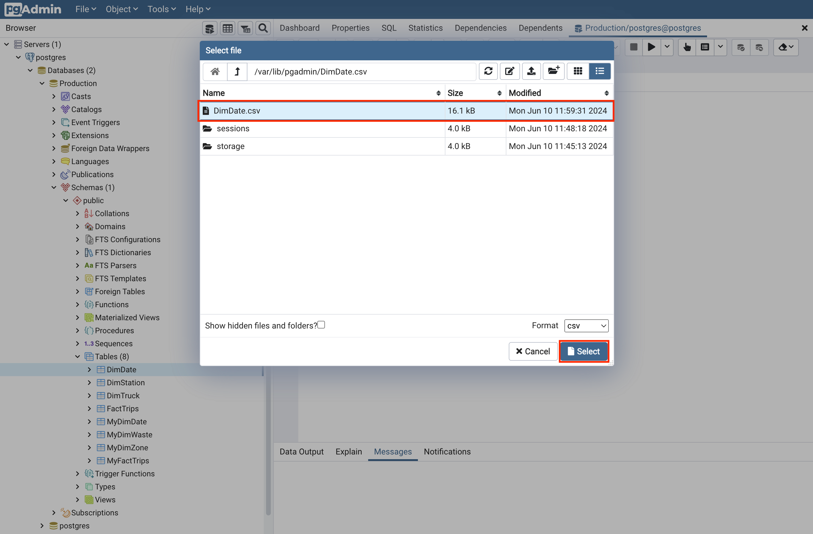

* Click **OK** and notification of import success will appear.


* Once the import has successfully completed, click the **X** icon on the **Import - Copying table data** page.


Confirm the successful import by displaying the first 5 rows in the DimDate table.

```text
SELECT *
FROM "DimDate"
LIMIT 5;
```

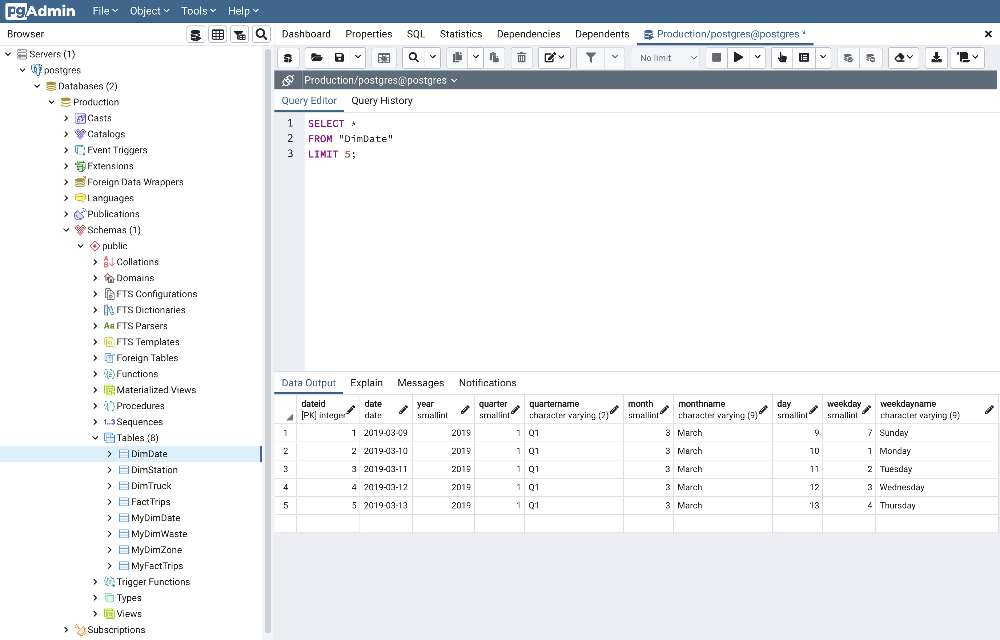

### Load data into the dimension table DimTruck

Repeat the steps as given in the [Load data into the dimension table DimDate](#load-data-into-the-dimension-tabledimdate) task to upload the `DimTruck.csv` file to load data into the DimTruck dimension table.

Confirm the successful import by displaying the first 5 rows in the DimTruck table.

```text
SELECT *
FROM "DimTruck"
LIMIT 5;
```

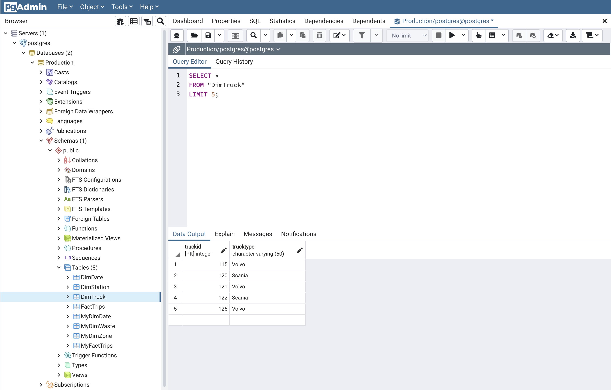

### Load data into the dimension table DimStation

Repeat the steps as given in the [Load data into the dimension table DimDate](#load-data-into-the-dimension-tabledimdate) task to upload the `DimStation.csv` file to load data into the DimStation dimension table.

Confirm the successful import by displaying the first 5 rows in the DimStation table.

```text
SELECT *
FROM "DimStation"
LIMIT 5;
```

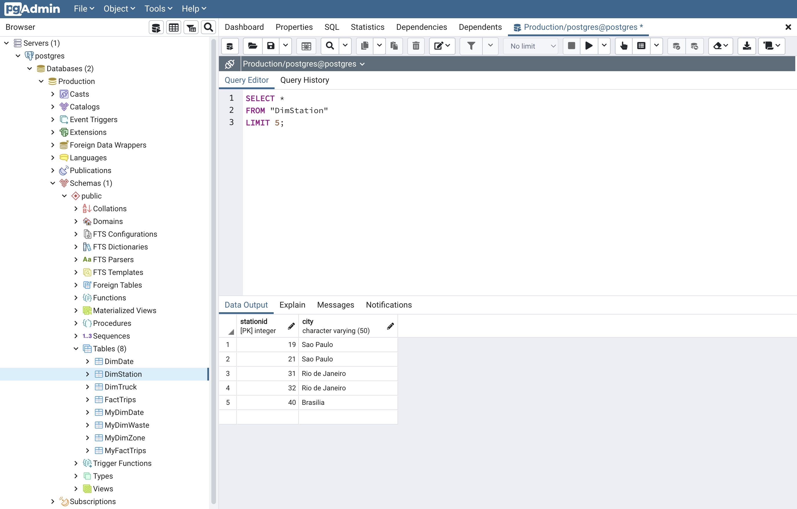

### Load data into the fact table FactTrips

Repeat the steps as given in the [Load data into the dimension table DimDate](#load-data-into-the-dimension-tabledimdate) task to upload the `FactTrips.csv` file to load data into the FactTrips fact table.

Confirm the successful import by displaying the first 5 rows in the FactTrips table.

```text
SELECT *
FROM "FactTrips"
LIMIT 5;
```

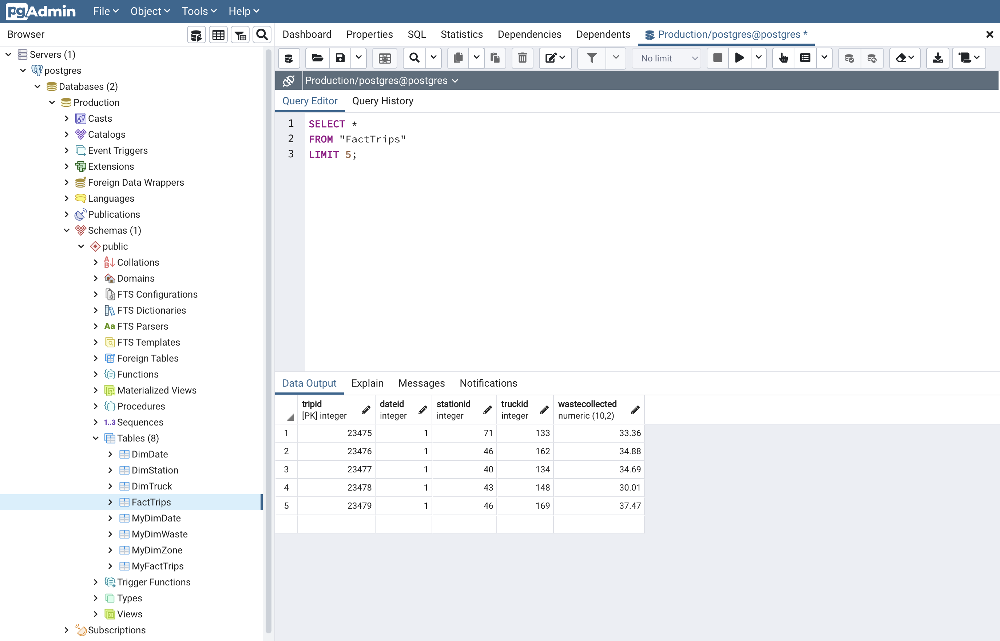


## Exercise 4 - Write aggregation queries and create MQTs

Next, I will query the data loaded in the previous exercise using grouping sets, rollups, and cubes for data aggregation and summarization, as well as utilize Materialized Query Tables (Materialized views) for efficient data querying. These skills are essential for managing and analyzing large datasets, particularly in data warehousing and business intelligence contexts.


### Create a grouping sets query

Create a grouping sets query using the columns stationid, trucktype, total waste collected.

```text
SELECT FT.Stationid,
  DT.TruckType,
  SUM(FT.Wastecollected) AS TotalWasteCollected
FROM "FactTrips" FT
  JOIN "DimTruck" DT ON FT.Truckid = DT.Truckid
GROUP BY GROUPING SETS (FT.Stationid, DT.TruckType)
ORDER BY FT.Stationid, DT.TruckType;
```


### Create a rollup query

Create a rollup query using the columns year, city, stationid, and total waste collected.

```text
SELECT DD.Year,
  DS.City,
  FT.Stationid,
  SUM(FT.Wastecollected) AS TotalWasteCollected
FROM "FactTrips" FT
  JOIN "DimStation" DS ON FT.Stationid = DS.Stationid
  JOIN "DimDate" DD ON FT.Dateid = DD.Dateid
GROUP BY ROLLUP(DD.Year, DS.City, FT.Stationid)
ORDER BY DD.Year, DS.City, FT.Stationid;
```


### Create a cube query

Create a cube query using the columns year, city, stationid, and average waste collected.

```text
SELECT DD.Year,
  DS.City,
  FT.Stationid,
  AVG(FT.Wastecollected) AS AverageWasteCollected
FROM "FactTrips" FT
  JOIN "DimStation" DS ON FT.Stationid = DS.Stationid
  JOIN "DimDate" DD ON FT.Dateid = DD.Dateid
GROUP BY CUBE(DD.Year, DS.City, FT.Stationid)
ORDER BY DD.Year, DS.City, FT.Stationid;
```


### Create an MQT

Create an MQT named max_waste_stats using the columns city, stationid, trucktype, and max waste collected.

```text
CREATE MATERIALIZED VIEW max_waste_stats AS
SELECT DS.City,
  FT.Stationid,
	DT.TruckType,
	MAX(FT.Wastecollected) AS MaxWasteCollected
FROM "FactTrips" FT
  JOIN "DimStation" DS ON FT.Stationid = DS.Stationid
  JOIN "DimTruck" DT ON FT.Truckid = DT.Truckid
GROUP BY DS.City, FT.Stationid, DT.TruckType;
```

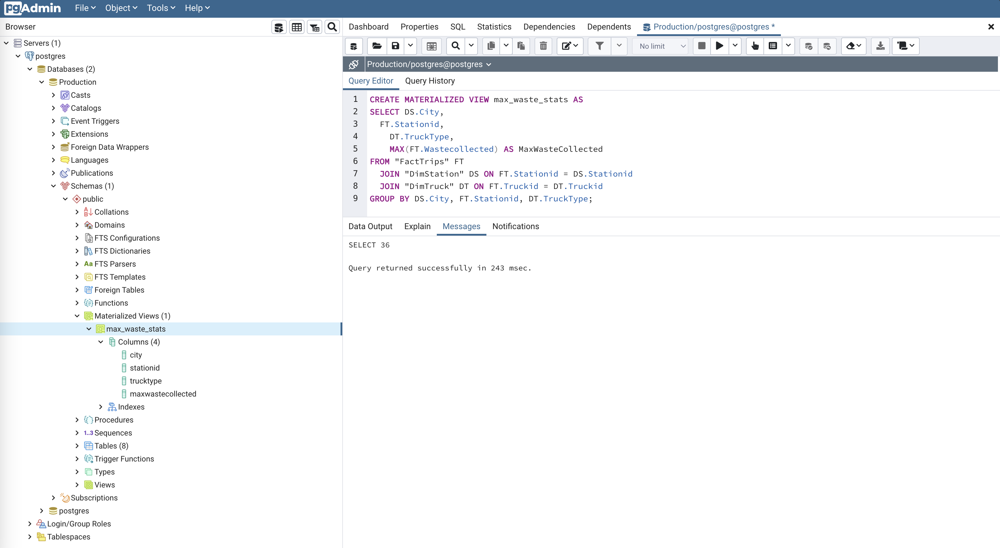

Execute the sql statement below to populate the MQT max_waste_stats

```text
REFRESH MATERIALIZED VIEW max_waste_stats;
```


Execute the sql statement below to query the MQT max_waste_stats

```text
SELECT *
FROM max_waste_stats;
```

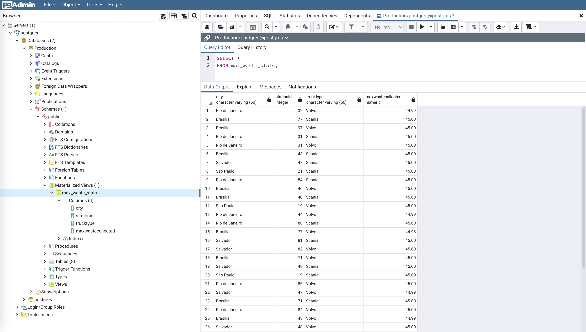


## Exercise 5 - Create a dashboard using Cognos Analytics

Follow these steps to upload the [DataForCognos_date.csv](./DataForCognos_date.csv) data file to Cognos Analytics:

1. Sign in to the Cognos Analytics platform with your IBMid, by navigating to [myibm.ibm.com/dashboard/](https://myibm.ibm.com/dashboard/). Then, scroll down and click **Launch**.


2. In the IBM Cognos Analytics menu, click **Upload data**.


3. Once it completes, the status bar will update to show the successful completion before closing.


4. From the menu, click **Recent**, then select the uploaded data file **DataForCognos_date.csv**.


5. The template window will be displayed. Here I have chosen the **four-panel template with 2x2 configuration**. Click **Create**.


### Create a pie chart in the dashboard

Create a pie chart that shows the waste collected by truck type.

1. From the **Navigation** panel, select **Sources** to ensure the data source panel is open in the left pane. From the data source panel, press the CTRL key and select **Wastecollected**, and **TruckType**, and drag them to the center of **Panel 1**, releasing them once you see the drop zone square turn blue.


2. Click the **Change visualization** button in the on-demand toolbar, which will currently say **Column**.


3. Then expand **All visualizations**, if needed, and select **Pie**.


4. Your **Panel 1** visualization should look similar to the one below. I made the following additional changes:
* Select the title of the visualization and change it to **Waste Collected by Truck Type**
* Highlight the title text and use the on-demand toolbar to change the properties of the title:
  * Click the **Color picker** icon, and change the color to Red
  * Click the font size drop-down menu and choose 18
* Right-click the **TuckType** legend title, select **Customize Label** and change the label to **Truck Type**
* Open the **Fields** panel, select **Format data**. Then, click the vertical ellipsis to the right of **Wastecollected** and change the data format to **Number** with 2 decimal places
* Click the **Properties** button in the top right corner to open the **Properties** panel and click the **General** tab. Expand **Appearance**, click **Border color** to open the color options for borders, and select a black border.


### Create a bar chart in the dashboard

Create a bar chart that shows the waste collected station wise.

1. From the **Navigation** panel, select **Sources** to ensure the data source panel is open in the left pane. From the data source panel, press the CTRL key and select **Wastecollected**, and **Stationid**, and drag them to the center of **Panel 2**, releasing them once you see the drop zone square turn blue.


2. Click the **Change visualization** button in the on-demand toolbar, which will currently say **Table**.


3. From **Recommended visualizations** or **All visualizations**, select **Bar**.


4. Your **Panel 2** visualization should look similar to the one below. I made the following additional changes:
* Select the title of the visualization and change it to **Waste Collected by Station ID**
* Highlight the title text and use the on-demand toolbar to change the properties of the title:
  * Click the **Color picker** icon, and change the color to Red
  * Click the font size drop-down menu and choose 18
* Right-click the **Stationid** label, select **Customize Label** and change the label to **Station ID**
* Right-click the **Wastecollected (Sum)** label, select **Customize Label** and change the label to **Waste Collected**
* Click the **Properties** button in the top right corner to open the **Properties** panel and click the **General** tab. Expand **Appearance**, click **Border color** to open the color options for borders, and select a black border.


### Create a line chart in the dashboard

Create a line chart that shows the waste collected by month wise.

1. From the **Navigation** panel, right-click the **DataForCognos_date.csv** data source and select **Calculation**.


2. Change the calculation name to **Month**. From the Components panel, click on the **Functions** icon, then select **Common Functions** and **D-G**. Drag **Extract** to the **Expression** field, and type: `month from Date_` within the parentheses. Click **OK**.


3. From the **Navigation** panel, select **Sources** to ensure the data source panel is open in the left pane. From the data source panel, press the CTRL key and select **Wastecollected**, and **Month**, and drag them to the center of **Panel 3**, releasing them once you see the drop zone square turn blue.


4. Your **Panel 3** visualization should look similar to the one below. I made the following additional changes:
* Select the title of the visualization and change it to **Waste Collected by Month**
* Highlight the title text and use the on-demand toolbar to change the properties of the title:
  * Click the **Color picker** icon, and change the color to Red
  * Click the font size drop-down menu and choose 18
* Right-click the **Wastecollected (Sum)** label, select **Customize Label** and change the label to **Waste Collected**
* Click the **Properties** button in the top right corner to open the **Properties** panel and click the **General** tab. Expand **Appearance**, click **Border color** to open the color options for borders, and select a black border.


### Create a pie chart in the dashboard

Create a pie chart that shows the waste collected by city.

1. From the **Navigation** panel, select **Sources** to ensure the data source panel is open in the left pane. From the data source panel, press the CTRL key and select **Wastecollected**, and **City**, and drag them to the center of **Panel 4**, releasing them once you see the drop zone square turn blue.


2. Click the **Change visualization** button in the on-demand toolbar, which will currently say **Bar**.


3. Then expand **All visualizations**, if needed, and select **Pie**.


4. Your **Panel 4** visualization should look similar to the one below. I made the following additional changes:
* Select the title of the visualization and change it to **Waste Collected by City**
* Highlight the title text and use the on-demand toolbar to change the properties of the title:
  * Click the **Color picker** icon, and change the color to Red
  * Click the font size drop-down menu and choose 18
* Open the **Fields** panel, select **Format data**. Then, click the vertical ellipsis to the right of **Wastecollected** and change the data format to **Number** with 2 decimal places
* Click the **Properties** button in the top right corner to open the **Properties** panel and click the **General** tab. Expand **Appearance**, click **Border color** to open the color options for borders, and select a black border.


[Final Solid Waste Dashboard](./Solid%20Waste%20Dashboard.pdf)


End of assignment.


## Change Log

| Date (YYYY-MM-DD) | Version | Changed By | Change Description |
|---|---|---|---|
| 2025-01-20 | 0.2 | Anthony J. Bopp | Modified to fulfill assignment requirements |
| 2025-01-20 | 0.1 | Anthony J. Bopp | converted Initial Version to postgres and Cognos workaround |

Copyright © 2021 IBM Corporation. All rights reserved.
